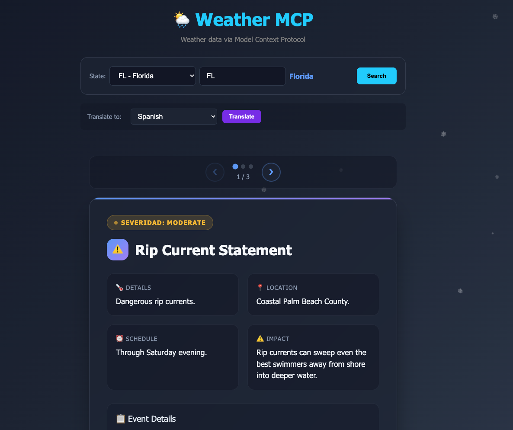
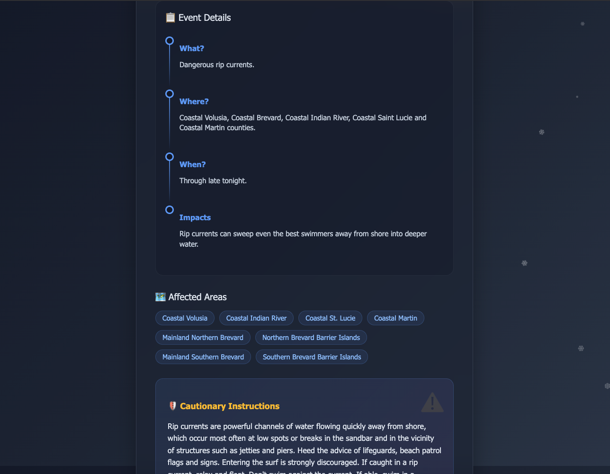

# 🌦️ Weather MCP Server

Monorepo containing the Weather MCP Server and UI frontend.

## 📸 Screenshots

### Alertas Meteorológicas


### Sin Alertas


---

## 📁 Estructura del proyecto

```
weather/
├── weather-mcp/          # Backend (MCP Server)
│   ├── main.py          # Entry point (stdio) - Claude Desktop
│   ├── main_http.py     # Entry point (HTTP) - Angular UI
│   ├── core/
│   ├── modules/
│   │   └── weather/
│   │       ├── entity.py
│   │       ├── service.py
│   │       ├── interactor.py
│   │       ├── presenter.py
│   │       └── router.py
│   ├── shared/
│   │   └── http_client.py
│   └── Dockerfile
│
└── ui-weather/           # Frontend (Angular)
    └── src/
        └── app/
            ├── components/
            │   ├── alerts/
            │   └── forecast/
            ├── services/
            │   ├── mcp.service.ts
            │   └── translation.service.ts
            └── models/
```

---

## 🚀 Dos formas de uso

### 1️⃣ Claude Desktop (stdio)

Usa `main.py` con transporte stdio para integrar con Claude Desktop.

```bash
cd weather-mcp
uv sync
uv run main.py
```

**Configuración en Claude Desktop:**

```json
{
  "mcpServers": {
    "weather": {
      "command": "docker",
      "args": ["run", "-i", "--rm", "weather-mcp"]
    }
  }
}
```

### 2️⃣ Angular UI (HTTP)

Usa `main_http.py` con transporte HTTP para servir la interfaz web.

```bash
cd weather-mcp
uv run main_http.py
# Servidor disponible en http://localhost:8000/mcp
```

Luego abre la UI en el navegador:

```bash
cd ui-weather
npm install
ng serve
# UI disponible en http://localhost:4200
```

---

## 🏗️ Arquitectura

```
┌─────────────────┐     ┌─────────────────┐     ┌─────────────────┐
│  Claude Desktop │     │   Angular UI    │     │   MCP Server    │
│    (stdio)      │     │   (HTTP :4200)  │     │  (HTTP :8000)   │
└────────┬────────┘     └────────┬────────┘     └────────┬────────┘
         │                       │                       │
         │                       │  JSON-RPC             │
         │                       │──────────────────────►
         │                       │                       │
         │                       │    SSE/JSON Response  │
         │                       │◄──────────────────────│
         │                       │                       │
         │                       │              ┌───────▼───────┐
         │                       │              │   NWS API      │
         │                       │              │ api.weather.gov│
         │                       │              └────────────────┘
```

**Flujo:**
1. Claude Desktop o Angular hacen requests al MCP Server
2. MCP Server procesa el request y llama a la API del National Weather Service
3. La respuesta se formatea y retorna al cliente

---

## 🌡️ Herramientas disponibles

### get_alerts

Obtiene alertas meteorológicas activas para un estado de EE.UU.

```python
get_alerts(state="CA")
```

### get_forecast

Obtiene el pronóstico del tiempo para una ubicación.

```python
get_forecast(latitude=37.7749, longitude=-122.4194)
```

---

## 🗺️ Códigos de Estados de EE.UU.

| Código | Estado          | Código | Estado              |
|--------|-----------------|--------|---------------------|
| AL     | Alabama         | MT     | Montana             |
| AK     | Alaska          | NE     | Nebraska            |
| AZ     | Arizona         | NV     | Nevada              |
| AR     | Arkansas        | NH     | New Hampshire       |
| CA     | California      | NJ     | New Jersey          |
| CO     | Colorado        | NM     | New Mexico          |
| CT     | Connecticut     | NY     | New York            |
| DE     | Delaware        | NC     | North Carolina      |
| FL     | Florida         | ND     | North Dakota        |
| GA     | Georgia         | OH     | Ohio                |
| HI     | Hawaii          | OK     | Oklahoma            |
| ID     | Idaho           | OR     | Oregon              |
| IL     | Illinois        | PA     | Pennsylvania        |
| IN     | Indiana         | RI     | Rhode Island        |
| IA     | Iowa            | SC     | South Carolina      |
| KS     | Kansas          | SD     | South Dakota        |
| KY     | Kentucky        | TN     | Tennessee           |
| LA     | Louisiana       | TX     | Texas               |
| ME     | Maine           | UT     | Utah                |
| MD     | Maryland        | VT     | Vermont             |
| MA     | Massachusetts    | VA     | Virginia            |
| MI     | Michigan        | WA     | Washington          |
| MN     | Minnesota       | WV     | West Virginia       |
| MS     | Mississippi     | WI     | Wisconsin           |
| MO     | Missouri        | WY     | Wyoming             |
|        |                 | DC     | District of Columbia|

---

## 🐳 Docker

### Build

```bash
# Build backend (MCP Server)
docker build -t weather-mcp ./weather-mcp

# Build frontend (Angular UI)
docker build -t ui-weather ./ui-weather
```

### Run

```bash
# Run both services
docker-compose up
```

**Servicios:**
- MCP Server HTTP: http://localhost:8000/mcp
- Angular UI: http://localhost:4200

### Run individual services

```bash
# Solo MCP Server (HTTP)
docker run --rm -p 8000:8000 weather-mcp uv run main_http.py

# Solo MCP Server (stdio para Claude)
docker run --rm -it weather-mcp uv run main.py
```

---

## 🌐 Traducción

La UI soporta traducción de resultados a múltiples idiomas:
- English
- Español
- Français
- Deutsch
- Português

Usa MyMemory Translation API (gratuita).

---

## ⚙️ Tecnologías

**Backend:**
- Python 3.11+
- FastMCP (MCP Server)
- httpx (HTTP async client)
- uvicorn (ASGI server)
- Clean Architecture + VIPER

**Frontend:**
- Angular 20+
- TypeScript
- RxJS
- CSS (dark theme)

**APIs:**
- National Weather Service (api.weather.gov)
- MyMemory Translation API

---

## 📄 Licencia

MIT
