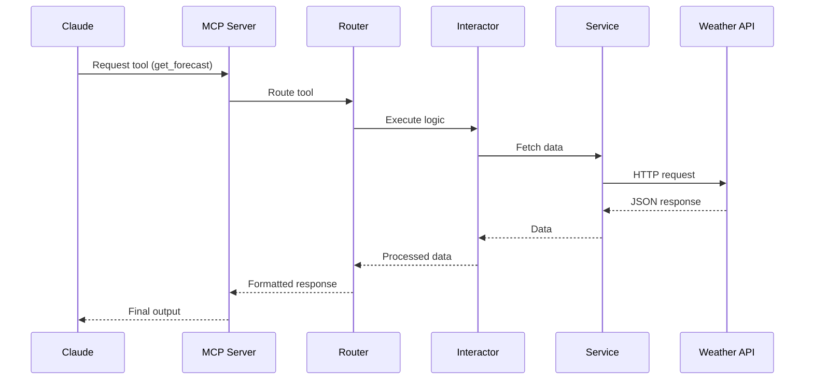

# 🌦️ Weather MCP Server — Python + Clean Architecture + VIPER

## 🚀 Overview

Este proyecto implementa un **servidor MCP (Model Context Protocol)** en Python que expone herramientas de clima consumiendo APIs externas en tiempo real.

Está diseñado como **pieza de portafolio**, demostrando:

* Integración de LLMs con herramientas externas (MCP)
* Arquitectura escalable (Clean Architecture + VIPER)
* Buenas prácticas (SOLID, async I/O, separación de responsabilidades)
* Consumo de APIs reales (National Weather Service)

---

## 🧠 ¿Qué problema resuelve?

Los modelos de lenguaje (LLMs) no tienen acceso directo a datos en tiempo real.

👉 Este servidor actúa como puente:

* Expone herramientas (`tools`)
* Conecta con APIs externas
* Devuelve respuestas estructuradas listas para el modelo

---

## 🧩 ¿Qué es MCP?

**Model Context Protocol (MCP)** es un estándar que permite que un modelo (como Claude) invoque herramientas externas de forma controlada.

📌 En este proyecto:

* Claude → invoca tool (`get_forecast`)
* MCP Server → ejecuta lógica
* API externa → retorna datos
* MCP → responde al modelo

---

## 🏗️ Arquitectura Actual

```text
weather-mcp/
│
├── main.py
├── weather.py
├── pyproject.toml
├── uv.lock
├── README.md
└── .venv/
```

---

## 🔷 Diagrama de Arquitectura

```mermaid
flowchart LR
    Client[Claude / MCP Client]
    MCP[MCP Server (FastMCP)]
    Router[Router (Tools)]
    Interactor[Interactor (Business Logic)]
    Service[Service (API Calls)]
    API[Weather API]

    Client --> MCP
    MCP --> Router
    Router --> Interactor
    Interactor --> Service
    Service --> API
    API --> Service
    Service --> Interactor
    Interactor --> Router
    Router --> MCP
    MCP --> Client
```

---

## 🔄 Flujo de ejecución



---

## ⚙️ Tecnologías

* **Python 3.10+**
* MCP Python SDK (`fastmcp`)
* `httpx` (async HTTP client)
* `uv` (environment & execution)
* API: https://api.weather.gov

---

## 📁 Estructura del proyecto a emigrar

✅ Clean Architecture + VIPER

```bash
weather-mcp/
│
├── main.py
├── core/
│   └── server.py
│
├── modules/
│   └── weather/
│       ├── entity.py
│       ├── interactor.py
│       ├── presenter.py
│       ├── router.py
│       └── service.py
│
├── shared/
│   └── http_client.py
│
├── pyproject.toml
└── README.md
```

---

## 🚀 Instalación

### 1. Clonar repo

```bash
git clone <repo-url>
cd weather-mcp
```

---

### 2. Crear entorno

```bash
uv venv
source .venv/bin/activate
```

---

### 3. Instalar dependencias

```bash
uv sync
```

---

## ▶️ Ejecución

```bash
uv run main.py
```

---

## 🔌 Configuración MCP (Claude Desktop)

```json
{
  "mcpServers": {
    "weather": {
      "command": "uv",
      "args": [
        "--directory",
        "/ruta/a/tu/proyecto",
        "run",
        "main.py"
      ]
    }
  }
}
```

---

## 🧪 Ejemplo de herramientas disponibles

### 🔹 Obtener alertas

```text
get_alerts(state="CA")
```

---

### 🔹 Obtener pronóstico

```text
get_forecast(latitude=37.7749, longitude=-122.4194)
```

---

## 🧠 Principios aplicados

### SOLID

* **S** → cada capa tiene una responsabilidad clara
* **O** → fácil extensión (nuevos módulos)
* **L** → reemplazo sin romper lógica
* **I** → interfaces simples
* **D** → desacoplamiento entre capas

---

## 📈 Escalabilidad

Este proyecto está preparado para:

* Integrar nuevas APIs (OpenWeather, etc.)
* Agregar nuevos módulos (tráfico, finanzas, etc.)
* Implementar caching
* Añadir autenticación
* Conectar con frontend (Angular / React)

---

## 🧩 Roadmap

* [ ] Cache con Redis
* [ ] Testing (pytest + mocks)
* [ ] Logging estructurado
* [ ] Dockerización
* [ ] Deployment

---

## 💼 Valor para portafolio

Este proyecto demuestra:

* Integración con LLMs (MCP)
* Arquitectura profesional
* Manejo de asincronía
* Consumo de APIs reales
* Pensamiento escalable

---

## 📄 Licencia

MIT
